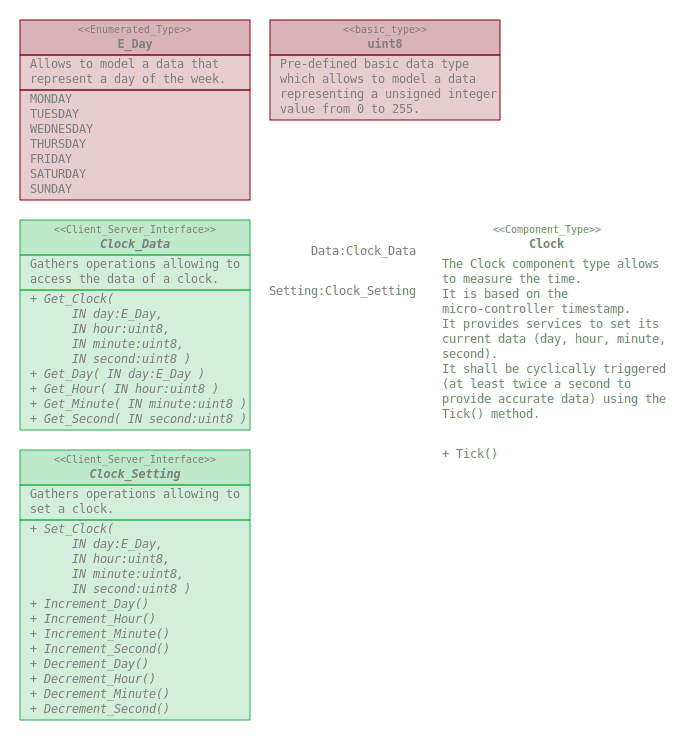

# Clock

Gathers software elements allowing to use a clock on an embedded software.

## Overview

## Dependencies

* Timing : https://github.com/SanteyneEmbeddedSystems/Timing/releases/tag/v1.0.0

## Use

### With the Arduino IDE

This repository shall be clone within the _librairies_ folder of the _Arduino
sketchbook folder_.
